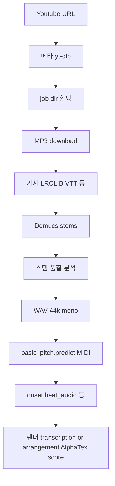

# 코드리뷰 결과 — Phase 1 ~ 8 (AI-Guitar-Tab)

플랜 `코드리뷰 Phase0-8 맵`에 따라 Agent가 산출한 **저장본**입니다. 플랜 파일은 수정하지 않았습니다.

---

## Phase 1 — 문서·설정·루트 스크립트

### Critical / Major / Minor 이슈

| 등급 | 이슈 | 증거·비고 |
|------|------|-----------|
| **Major** | README 상단에 **PowerShell 명령어가 마크다운 본문에 그대로** 붙어 있어 첫 줄 제목 다음이 혼동됨 | [README.md](README.md) L1–L18 |
| **Major** | **루트 `app/`**(별도 FastAPI) 서버가 실행 경로 안내에서 **언급되지 않음** — 온보딩 혼선(Phase 0·6과 동일) | [app/main.py](app/main.py) vs 문서상 `backend/` 단독 |
| **Minor** | README 내 **외부 상업 사이트 URL** 단독 줄(L24) 맥락 없음(북마크?) | README.md |
| **Minor** | Fret-T5 예시에 **실제 디스크 패턴처럼 보이는 절대 경로** 포함(샘플이지만 차터 “개인 경로 하드코딩 금지”와 사용자 혼동) | README.md L79–L80 |

### 차터([AI-GUITAR-TAB-AI-CODING-CHARTER.md](AI-GUITAR-TAB-AI-CODING-CHARTER.md)) 정합성

- README **파이프라인 요약**(yt-dlp → Demucs → Basic Pitch → MIDI 템포 → AlphaTex)은 차터 §3와 **일치**.
- 차터 비목표(무단 스트리밍 확대 등)와 README 데이터 출처 서술 **충돌 없음**.

### 문서 패치 초안 불릿

- README 최상단: “개인 메모 블록”을 **별도 `CONTRIBUTING`/스크린 캡슐** 또는 **접은 섹션**으로 이동.
- README에 추가: **`run_backend_from_repo_root.ps1`**: reload 없음(장시간 작업)·**`run_backend_py311.ps1`**: `--reload` 사용 차이 표.
- 루트 `app/`는 “**레거시/실험**” 또는 “**더 이상 권장 경로 아님**” 한 줄 + 링크.

### Phase 2로 넘길 미해결 의문

- 루트 `app/`를 **유지/삭제/아카이브**할 제품 의사결정.
- 로컬 프론트가 `127.0.0.1:8000` 직통을 쓰는데 Next rewrite와 **항상 같은 백엔드**인지 운영 시나리오.

---

## Phase 2 — 백엔드 API·진입점·설정

### 이슈

| 등급 | 이슈 | 증거 |
|------|------|------|
| **Minor** | `run_uvicorn.ps1`는 `--reload`; `run_backend_py311.ps1`도 `--reload` — 장시간 파이프라인에서 **ECONNRESET** 우려 문서만 있고 스크립트는 통일 안 됨 | [backend/run_uvicorn.ps1](backend/run_uvicorn.ps1), [run_backend_from_repo_root.ps1](run_backend_from_repo_root.ps1) 비교 |
| **Major**(보안 후속 Phase 7) | `/api/youtube/tab-preview`: **무인증** 긴 실행(최대 1800초)·**외부 yt-dlp**·Demucs 리소스 | [backend/app/main.py](backend/app/main.py) |
| **Minor** | MIDI 업로드는 확장자·빈 파일 검사함; 업로드 크기 상한 명시 필요 여부 | `midi_tab_preview` |
| **Info** | CORS 허용 origin이 로컬/일부 포트로 **명시**(프로덕션 전환 시 재검토) | main.py CORSMiddleware |

### API 계약 요약

- `GET /health` → `{ "status": "ok" }`
- `POST /api/youtube/tab-preview` Body: `{ url: HttpUrl, jobId?: str }` → `{ title, artist, lyrics?, lyrics_source?, score, alphatex }` (타임아웃 504 vs 메시지 “30분”은 1800초와 일치)
- `GET /api/youtube/tab-preview/progress/{job_id}` → 진행 상태(없으면 idle)
- `POST /api/midi/tab-preview` multipart MIDI → `{ title, score, alphatex, tab_quality? }`

### 후속 Agent 작업 후보

- README/스크립트: **`--reload` 정책** 한 줄 표 + 개발 모드 플래그 옵션.
- `UploadFile`: **최대 바이트** 제한(Optional).

---

## Phase 3 — 백엔드 파이프라인 코어

### 단계 다이어그램 (요약)

실제 이름·분기는 [backend/app/services/pipeline.py](backend/app/services/pipeline.py) 단일 파일에 집중.

### 이슈

| 등급 | 이슈 |
|------|------|
| **Major** | `pipeline.py` **대형 단일 파일** — 리뷰·병합·테스트 격리 비용 큼 |
| **Major** | **도메인 이슈(차터):** 코드에 이미 `CAPO_CANDIDATE_RANGE=(0,5)`, arrangement/transcription 분기 있음 → 차터 제품 규칙과 **방향 일치**(세부 ALPHA 표기 검증은 TDD 필요) |
| **Minor** | `MIN_NOTE_VELOCITY`, onset 병합 상수 등 **튜닝 상수 과다·문서화 산발** |

### 리팩터 후보 Top 10 (우선순위 순)

1. `run_four_step_pipeline` 본문을 **모듈/파일**(download, stems, midi, render) 분리  
2. **진행률 콜백** 타입을 TypedDict 등으로 명시  
3. job 디렉터리 레이아웃을 **단일 함수**에서 생성 규격화  
4. 환경 플래그(`TAB_RENDER_MODE` 등) **한 모듈**에서만 읽기  
5. Basic Pitch 호출 레이어 **명시적 어댑터**  
6. 가사 분기 (`_resolve_youtube_lyrics`) **별 파일**  
7. AlphaTex 생성 `_render_*` **패키지 분리**  
8. 타입 검사(pass mypy 선택 구역) 시작점  
9. 로그 레벨/구조 통일(print vs logging)  
10. **단위 테스트 타겟 후보**(카포 클램프, 코드 라벨 스무딩) 추출  

---

## Phase 4 — 전사·ML·외부 프로세스·오디오

### 위험도 높은 연산/OS

- `subprocess.run`: **ffmpeg**, **yt-dlp**, **`python -m demucs.separate`**, **`python -m basic_pitch.predict`**, yt-dlp 자막 호출 등 — [pipeline.py](backend/app/services/pipeline.py)  
- **별도 파이썬**: Omnizart [omnizart_guitar.py](backend/app/services/omnizart_guitar.py) (`OMNIZART_PYTHON`, `.venv_omnizart`)  
- **ONNX**: requirements `basic-pitch[onnx]`, onnxruntime  

### 이슈

| 등급 | 이슈 |
|------|------|
| **Major** | Basic Pitch/`demucs`/torch 의존 **실패 시** 사용자 메시지·폴백 경로 명확성은 개별 블록 try에서 재점검 권장 |
| **Minor** | `analyze_onsets_from_guitar_audio` **max_duration_sec=600** — README “수십 초 제한 가능” 문구와 **수치 불일치** 가능 |
| **Info** | [test_tab_experiment_smoke.py](backend/scripts/test_tab_experiment_smoke.py): 초소형 MIDI로 `_render_*`만 검증 — **E2E·실오디오** 아님 |

### 테스트 갭

- fixture 짧은 **실제 WAV 스텝** 또는 **녹음 MID** 회귀 1건  
- `compare_tab_midi_to_reference`(tab_playback) 활용한 **Recall 게이트** 자동화(선택)

---

## Phase 5 — 프론트엔드

### 이슈

| 등급 | 이슈 |
|------|------|
| **Minor** | [page.tsx](frontend/src/app/page.tsx): 로컬에서 **백엔드 직결** 하드코딩 호스트와 Next rewrite 공존 — 문서 한 줄 필요 |
| **Minor** | [ScoreViewer.tsx](frontend/src/components/ScoreViewer.tsx) 대형 파일(1500+ LOC) — **분리 후보**(툴바/플레이어/악보 프리뷰) |
| **Info** | 테스트 스코어: [frontend/src/app/api/test-score/current/route.ts](frontend/src/app/api/test-score/current/route.ts) + [testScoreConfig.ts](frontend/src/lib/testScoreConfig.ts) 로컬 DX용 |

### 상태관리

- `Home` 페이지: **페이지 레벨 useState 중심** — 현재 규모에 **과잉 전역 불필요**. ScoreViewer 내부만 복잡.

### 후속 Agent

- 접근성: 메인 버튼/로딩 `aria-busy`, 포커스 링 검토(QA 체크리스트).

---

## Phase 6 — 스크립트·레거시 `app/` 중복

### 중복·분기 표

| 루트 레거시 | backend 대응 관념 |
|-------------|-------------------|
| [app/services/audio_service.py](app/services/audio_service.py) `yt-dlp` → WAV | pipeline 내 `_download_mp3` + ffmpeg 경로 등 **다른 포맷/흐름** |
| [app/services/separation_and_lyrics_service.py](app/services/separation_and_lyrics_service.py) | Demucs 등 **별도 레이어**(확인: 실제 라인 매핑은 추후 필요 시 Diff) |
| [app/services/chord_analysis_service.py](app/services/chord_analysis_service.py) | 파이프라인 `_bar_chord_labels` 등 **통합 버전 우선** |
| [app/main.py](app/main.py) | [backend/app/main.py](backend/app/main.py) **실제 타브 미리보기 API 소유** |

### 단일 진실 소스 권장

- **제품 API·유튜브 타브**: `backend/app/**` 만 **SoT** 로 문서화.  
- 루트 `app/`은 “미사용 레거시”면 **DEPRECATED 헤더** 또는 제거 후보 PR.

### 제거 시 위험

- 외부 링크/과제 조건으로 루트 `app/`을 아직 참조하면 **먼저 grep·확인** 후 아카이브.

---

## Phase 7 — 보안·운영 (종단)

### 위협 모델 (5줄)

1. 무인증 클라이언트가 **`/api/youtube/tab-preview`** 로 **무거운 외부 I/O/GPU 작업**을 트리거(DoS 남용·거주 서버 비용).  
2. **MIDI 업로드**가 `data/uploads`에 쓰임 — 디스크 고갈·악성 파일명(일부 sanitized).  
3. **`jobId` 추측**으로 진행률 폴링(민감도 낮으나 상태 노출 패턴 확인).  
4. **외부 네트워크**: yt-dlp 대상은 유튜브 제한되어 있어도 **서버 egress** 존재.  
5. **에러 `detail`** 이 스택 일부 노출 가능(HTTPException) — 내부 경로 줄이기.  

### Critical / Major

| 등급 | 항목 | 패치 방향(문장) |
|------|------|----------------|
| **Critical**(운영 공개 시) | 무인증 비용 높은 엔드포인트 | API 키·로그인·IP 제한 또는 큐 길이/동시 처리 상한 도입 검토 |
| **Major** | 업로드 MIDI 크기 무제한 | 본문 길이/파일 크기 제한 및 실패 코드 통일 |
| **Major** | `_PIPELINE_PROGRESS` 메모리 누적 | TTL 정리 또는 job 완료 시 삭제 정책 |
| **Minor** | 진행 조회 무인증 | jobId 무작위성·예측 난이도는 있으나 민감 메타 포함 시 검토 |

### 차기 스프린트(보안·운영)

- 동시 **in-flight 요청 제한**(세마포), 업로드 **max bytes**.
- 장애 공통 응답 `{ code, message }` 정리(프론트와 합의).

---

## Phase 8 — 통합 백로그 및 리팩터링 순서

Phase 1~7 표를 여기까지 병합·중복 제거한 결과입니다.

### Critical 우선(공개 배포 관점에서 먼저)

1. **무인증 비용 공격 노출**(긴 타임아웃 파이프라인) 완화  
2. **업로드/디스크** 한도  

### Sprint 1 (3–7 카드, 한 PR 묶음 권장: “문서 + 스크립트만” 또는 “운영 분리”)

- README 재구조(상단 셸 블록 제거/이동) + **듀얼 서버 설명**(backend vs root `app/`)  
- `--reload` 정책 문서 및 스크립트 옵션 정렬  
- Phase 7: **업로드 최대 크기**(백로그 착수)  
- API 오류 메시지 **사용자용/내부용** 분리 초안  

### Sprint 2 (중규모, PR 분리 권장)

- **`pipeline.py` 1차 분리**(download/stems/render 디렉터리) — **테스트 회귀** 필수라 작은 단위부터  
- **스모크 + 1건 실험 WAV/MIDI fixture** 추가  
- **ScoreViewer** 서브컴포넌트 추출 1차  
- **루트 `app/` deprecation** 또는 제거 계획 PR  

### 한 PR에 넣으면 안 되는 덩어리 예시

- **대형 pipeline 분리 + 보안 행 변경 + 프론트 대규모 리라이트** 동시 진행 금지.  
- ONNX/venv/의존성 버전 갱신과 **렌더 수치 튜닝** 동합본 금지(회귀 판별 어려움).

### 차터·README 갱신 권장(별도 섹션)

- README: **AI 차터 링크**(`docs/AI-GUITAR-TAB-AI-CODING-CHARTER.md`) 및 규칙 파일 (이미 사용자 작업 가능) 반영 상태 유지  
- 테스트 기대치: “정답 타브 단일 문자열 불가” 명시 차터 §7 재인용 가능  

---

### 후속 작업 메모

- 각 항목 **Agent 실행 시**: 차터 허용 파일 목록·범위를 프롬프트에 포함.  
- 이 문서 수정일을 커밋 메시지에 남길 필요는 선택.
