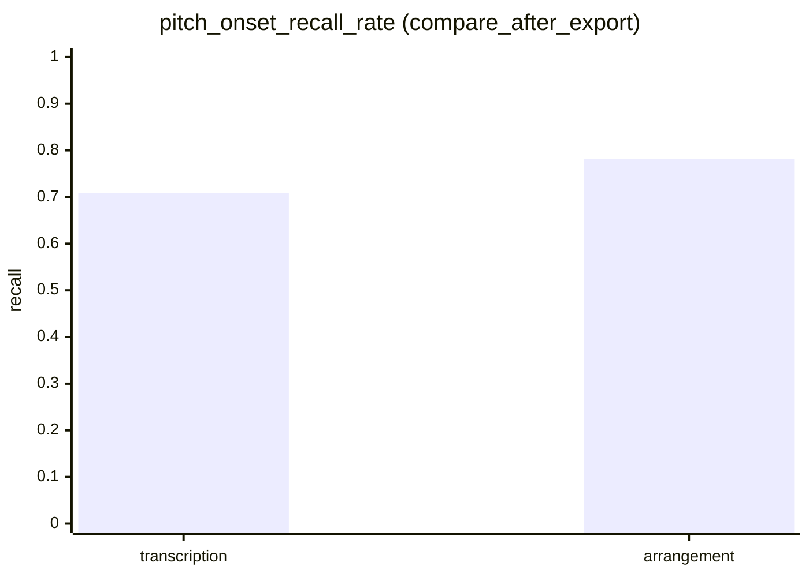
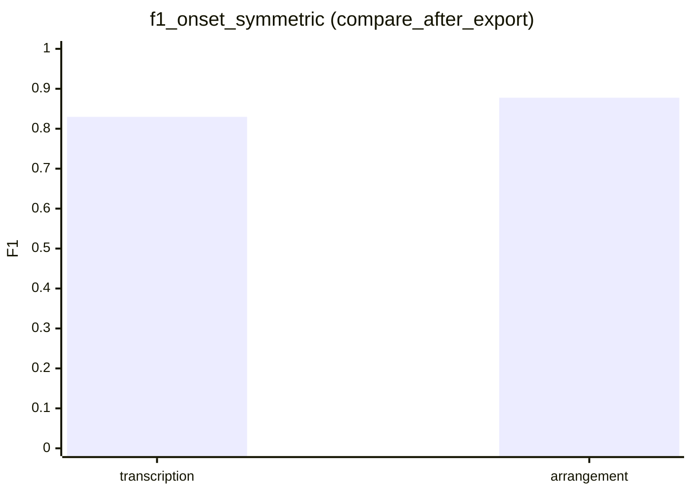

# 반복 수정 기록 — TAB 렌더 모드 A/B (transcription vs arrangement)

## 실험 개요

- **입력 영상:** `https://www.youtube.com/watch?v=nDbNRb9gOr4` (동일 URL, 동일 코드베이스)
- **비교 축:** `TAB_RENDER_MODE`만 변경 (추론 스택 Demucs → Basic Pitch 등은 동일)
- **UI 캡처:** `http://127.0.0.1:3000` ScoreViewer, Playwright 고정 뷰포트 **1280×720**, 헤드리스 Chromium (브라우저 배율 100%에 해당하는 CSS 픽셀 기준)
- **잡 산출물:** `backend/data/jobs/` 하위 (uvicorn cwd가 `backend`일 때). 본 실험에서는 URL 해시 접미사 `e0379f5f` 폴더 `-12`(transcription), `-13`(arrangement) 사용

---

## 1. 무엇을 바꿨는지

| 실행 | 환경 변수 (PowerShell, 백엔드 기동 직전 동일 창) | 비고 |
|------|---------------------------------------------------|------|
| A — transcription | `.\backend\scripts\clear_tab_experiment_env.ps1` 후 `$env:TAB_RENDER_MODE = "transcription"` 및 `TAB_ARRANGEMENT_MIN_RECALL` 제거 | uvicorn **단일 프로세스** (`--reload` 없음) 로 모드 혼선 방지 |
| B — arrangement | `$env:TAB_RENDER_MODE = "arrangement"`; `$env:TAB_ARRANGEMENT_MIN_RECALL = "0.80"` | README 권장 편곡형 설정 |

- **코드 상수:** 변경 없음 (`pipeline.py`의 `TAB_RENDER_MODE_DEFAULT` 등 미수정).

---

## 2. 왜 바꿨는지 (설계 근거)

- **README:** `transcription`은 기본 전사형, `arrangement`는 코드·패턴 중심으로 리듬을 **8분 해상도**에 맞추는 편곡형. `TAB_ARRANGEMENT_MIN_RECALL`(기본 0.80) 미만이면 arrangement 렌더를 **1회 완화 재시도**한다고 명시되어 있다.
- **`TabRenderPreset` (`backend/app/services/pipeline.py`):**
  - **transcription:** `unified_grid=False`, 16분 단위 기본(`base_den=16`), `use_emit_mdp=False`, `onset_gate_mode="hard"` 등 — 전사에 가깝게 세밀한 그리드.
  - **arrangement:** `unified_grid=True`, `subdivisions_per_quarter=2`(= **8분**), `use_emit_mdp=True`, `use_fingering_v2=True`, `onset_gate_mode="soft"` — 운지 MDP·코드 스무딩·그리드 경계 정렬을 켠 편곡 파이프라인.

---

## 3. 결과가 어떻게 달라졌는지

### 3.1 정량 (`compare_report.json` · `summary.json`)

| 항목 | transcription (-12) | arrangement (-13) |
|------|---------------------|---------------------|
| `alphatex_rhythm_mode` | `transcription_legacy` | `arrangement_eighth` |
| `pitch_onset_recall_rate` (compare_after_export) | **0.709** | **0.7821** |
| `f1_onset_symmetric` | 0.8297 | 0.8777 |
| 탭 MIDI 노트 수 (`tab_note_count`) | 1457 | 1583 |
| 참조 기타 노트 수 (`reference_guitar_note_count`) | 2055 | 2093 |
| `mean_tokens_per_bar` (tab_experiment) | 21.47 | 15.39 |
| `grid_step_sec` | 0.0625 (16분 단위) | 0.25 (8분 단위) |
| **품질 게이트** | 적용 대상 아님 (`arrangement_retry_applied`: false) | 초기 recall **0.7463** → 재시도 후 **0.7821** (`arrangement_retry_applied`: **true**) |

### 3.2 스크린샷 (동일 뷰포트)

- transcription: [`tab_compare_nDbNRb9gOr4_transcription.png`](tab_compare_nDbNRb9gOr4_transcription.png)
- arrangement: [`tab_compare_nDbNRb9gOr4_arrangement.png`](tab_compare_nDbNRb9gOr4_arrangement.png)

### 3.3 주관적 가독성 (요약)

- **transcription:** 마디당 토큰이 많고(평균 약 21.5), 미세 리듬·밀도가 높아 **전사 디테일**은 살아 있으나 한 화면에 정보가 붐빈다.
- **arrangement:** 8분 그리드로 정렬되며 마디당 토큰이 줄고(평균 약 15.4), **코드 진행·패턴**을 읽기 쉬운 쪽으로 단순화된 인상이다. recall·F1은 다소 우호적으로 나타났으나, 참조 MIDI 대비 비교 지표이므로 “청음 정답”과 동일하지 않을 수 있다.

---

## 4. 모델·파이프라인 비교표 / 그래프

동일 **오디오 파이프라인**(유튜브 → Demucs → Basic Pitch 등) 위에서 **탭 렌더 프리셋만** 바뀐 비교다.





---

## 5. 변화 원인 분석

1. **그리드·토큰 밀도:** arrangement는 `base_den=8`, 통합 그리드로 노트 배치를 정렬해 AlphaTex 마디 토큰 수가 감소했다. 이는 가독성과 “편곡형” 목표와 방향이 일치한다.
2. **운지 MDP·소프트 온셋 게이트:** 연속 운지·코드 스무딩에 유리한 설정으로, 표현 단순화와 함께 탭 MIDI 상에서의 대표(reference 대비) recall/F1 수치가 상승한 형태로 관측되었다.
3. **recall 게이트 재시도:** `-13`에서 초기 `pitch_onset_recall_rate`가 0.80 미만(0.7463)이어서 README대로 **완화 재시도**가 적용되었고, 최종 compare 리포트 기준 recall은 **0.7821**로 기록되었다. (여전히 게이트 0.80에는 미달이나, 재시도로 초기 대비 개선.)

---

## 재현 메모 (Windows PowerShell)

1. 포트 **8000** 점유 프로세스를 정리한 뒤, 모드별로 **백엔드를 한 번씩만** 띄운다 (`--reload` 다중 프로세스 시 환경 혼선 방지용으로 단일 uvicorn 권장).
2. 프론트: `frontend`에서 `npm run dev` → `http://localhost:3000`
3. 스크린샷 재실행 (헤드리스):

```powershell
cd "C:\Users\kwakm\OneDrive\Desktop\Cusor-Project\AI-Guitar-Tab-main"
.\backend\.venv311\Scripts\pip.exe install playwright
.\backend\.venv311\Scripts\playwright.exe install chromium
.\backend\.venv311\Scripts\python.exe .\backend\scripts\capture_tab_ui_viewport.py `
  --youtube-url "https://www.youtube.com/watch?v=nDbNRb9gOr4" `
  --out ".\docs\tab_mode_ab\tab_compare_nDbNRb9gOr4_transcription.png"
```

(arrangement 실행 전에는 백엔드를 종료하고 `TAB_RENDER_MODE`/`TAB_ARRANGEMENT_MIN_RECALL`을 바꿔 재기동한다.)

---

## 산출물 목록

| 파일 | 설명 |
|------|------|
| `docs/tab_mode_ab/tab_compare_nDbNRb9gOr4_transcription.png` | transcription UI 캡처 |
| `docs/tab_mode_ab/tab_compare_nDbNRb9gOr4_arrangement.png` | arrangement UI 캡처 |
| `docs/tab_mode_ab/metrics_extracted.json` | 위 수치 요약 |
| `backend/scripts/capture_tab_ui_viewport.py` | 동일 뷰포트 캡처 스크립트 |

PDF가 필요하면 본 Markdown을 Pandoc 등으로 변환하면 된다.
